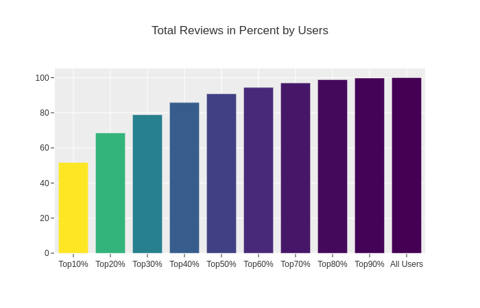
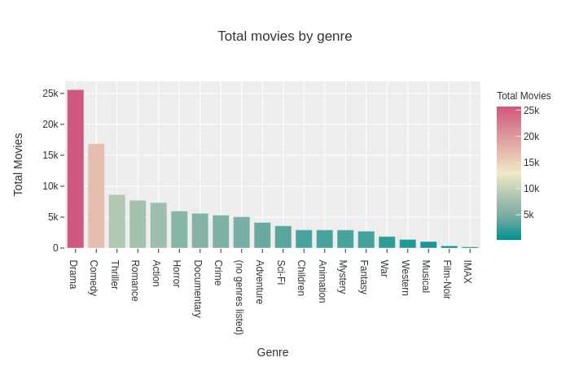
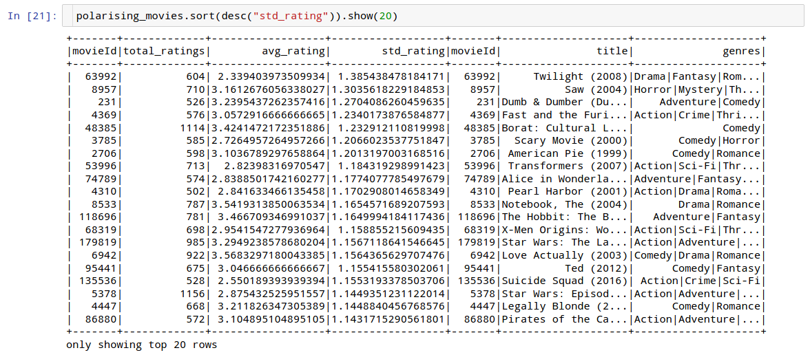

# Project: Movie Recommender


### Description

This project implements a movie recommender using a variety of recommendation systems (NMF, ALS and Cosine Similarity).  
For this the popular [Movielens](https://grouplens.org/datasets/movielens/) dataset (largest 25M version, reduced to 1.1M ratings from 2019) is used.  
[Flask](https://flask.palletsprojects.com/en/1.1.x/) is used to build a web app that gives users personalized recommendations and basic movie infos.  
[Apache Spark](https://spark.apache.org/), a cluster-computing framework for very large amounts of data, is used to run the ALS (Alternating Least Squares) model, NMF and Cosine Similarity are implemented with [Scikit-Learn](https://scikit-learn.org/stable/).  
[Dash](https://dash.plotly.com/) is used to visualize rating informations (average rating and total ratings over time, ratings per user).  

This project started as a great group project together with [Julia](https://github.com/julisep) and [Alvaro](https://github.com/alperdomo) during SPICED's Data Science program and is now continued solo afterwards.

### Goal

Become more familiar with recommendation systems and big data management.

### Background

Companies like Netflix or Amazon prominently use recommendation systems to generate more user-oriented suggestions.  
[Non-Negative Matrix Factorization](https://en.wikipedia.org/wiki/Non-negative_matrix_factorization), [Collaborative Filtering](https://en.wikipedia.org/wiki/Collaborative_filtering) are two techniques used by recommender systems that are implemented in this project.

### Data

The movie recommender is based on the latest dataset released by MovieLens in 12/2019 that includes 25 million ratings.  
All data is stored in a [Postgres](https://www.postgresql.org/) database on an AWS RDS.  
Data was reduced to ratings from 2019 (~1.15 million ratings).

Example SQL query (get average rating and total ratings for movies in 2019):

```
SELECT 
		movies.movie_id,
    	movies.title,
    	movies.genres,
    	AVG(ratings_2019.rating) AS avg_rating,
    	COUNT(ratings_2019.user_id) AS total_ratings
FROM
		movies
JOIN 
		(
		SELECT 
		 		ratings.user_id,
    			ratings.movie_id,
    			ratings.rating
   		FROM ratings
  		WHERE ratings.rating_timestamp >= '2019-01-01'
		)
		AS ratings_2019 
ON 
		ratings_2019.movie_id = movies.movie_id
GROUP BY 
		movies.movie_id, movies.title, movies.genres
ORDER BY 
		total_ratings DESC, avg_rating DESC;
```

### Movie Selection

Movies on the landing page were selected based on how popular they were in 2019, how representative they are for a certain genre and how polarising they are among viewers.  
_Planet Earth II_ for example received the highest average score among all movies that were rated at least 250 times.  
_Twilight_ on the other hand is the most polarising movie of 2019.

### Notebooks

An exploratory data analysis is performed with pandas [here](https://github.com/senzelden/recommender/blob/dennis/scripts/movielens_eda_dennis.ipynb).  
An additional analysis is done with pyspark [here](https://github.com/senzelden/recommender/blob/dennis/scripts/movielens_pyspark.ipynb).





### Apache Spark (great sources)

Good overview for pyspark: https://runawayhorse001.github.io/LearningApacheSpark/pyspark.pdf  
Holden Karau's Videos on Spark: https://www.youtube.com/playlist?list=PLRLebp9QyZtaoIpE2iaF3Q8itJOcdgYoX  

### To Do
* Add tests
* Implement dash dashboard for basic infos on ratings in dataset
* Implement spark udfs instead of regular python functions in ALS recommender to potentially improve speed
* Try out spark script on cloud cluster with spark-submit
* Make web app accessible on heroku or github
